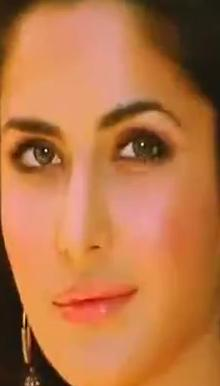
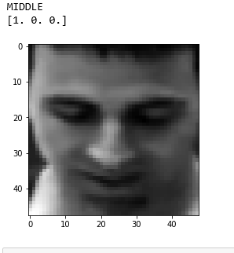
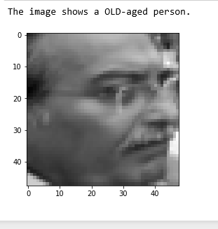
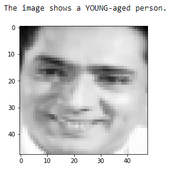
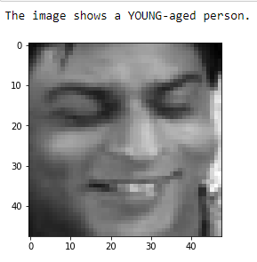

# AgeDetection-in-Keras

This is a model created based on the Age-Detection challenge hosted by Analytics Vidhya.
The link for the data is here
  'https://datahack.analyticsvidhya.com/contest/practice-problem-age-detection/'
  
The problem is based on the input being the images of Indian actors and the output being the labels in three
different classes ie YOUNG,MIDDLE and OLD.
The images come in different sizes, some of them are grayscale and some in RGB format 
and  some are in different lightning conditions.

    

I decided to fix the input size to be (48,48,1). Note that the last item in the tuple depicts that the images 
have been converted to grayscale.
Because the faces are invariant to color-intensity, i purposely converted all the images into grayscale.

 

I fed all the images into a Convolutional Network and achieved a good accuracy. However,the model wasn't able to generalize well.
So, i flipped all the training images and matched their labels. This kind of data-augmentation made the model generalize well.

The model is able to reach a training accuracy of 84% with a validation around 76%.

     
